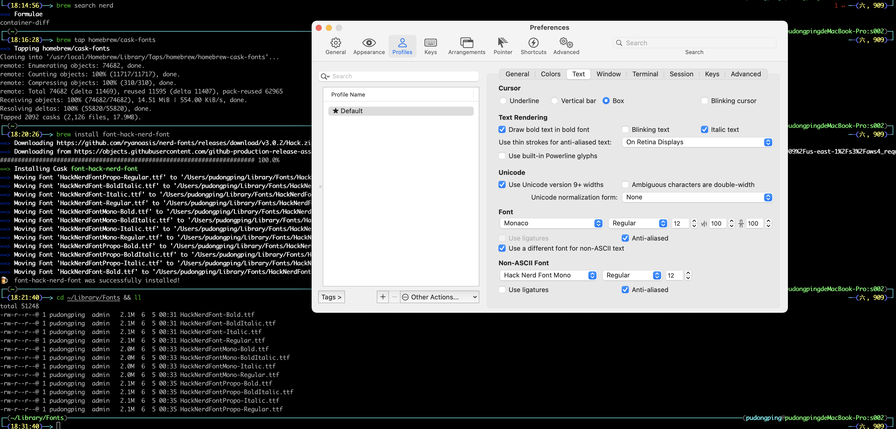

# [Neovim](https://github.com/neovim/neovim)

## 使用 Neovim

本目录下有两套 neovim 的配置，均可直接使用。区别如下：

- [nvim-config](./nvim-config) ：使用 [folke/lazy.nvim](https://github.com/folke/lazy.nvim) 作为插件管理器，找各种插件进行配置。
- [oh-my-lazy-vim](./oh-my-lazy-vim)：使用 [LazyVim](https://www.lazyvim.org/installation) 作为配置模版，在此基础之上添加的各种插件。

## 所需安装的软件

### 使用 homebrew 安装 neovim

```bash
# https://formulae.brew.sh/formula/neovim
brew install neovim
```

查看 neovim 版本号

```bash
nvim --version
```

### 安装 git

```bash
brew install git
```

### 安装 fzf

```bash
brew install fzf
```

### 安装 rg

```bash
brew install ripgrep
```

### 安装 iTerm2

```bash
brew install iterm2
```

### 安装字体 [nerd-fonts](https://github.com/ryanoasis/nerd-fonts#font-installation)

> 方便显示一些小图标。

```bash
brew tap homebrew/cask-fonts
brew install font-hack-nerd-font
```

查看安装后的字体

```bash
cd ~/Library/Fonts && ll
```

对 iTerm2 设置字体。需要勾选 **Use a different font for non-ASCII text** 来启动第二字体。然后在 **Non-ASCII Font** 下选择 `Hack Nerd Font Mono` 字体。
可以参考下图所示。



## 如何使用配置？

建议通过软连接的方式使用配置信息，自己的个人配置还可以通过版本管理软件 git 进行管理。

比如，如果需要使用 `nvim-config` 目录下的配置信息时：

```bash
# 直接通过建立软连接的方式使用（要使用绝对路径的方式）
# eg：
ln -s /Users/pudongping/glory/codes/code/home-profile/Neovim/nvim-config/nvim $HOME/.config/nvim
# 或者使用如下方式，效果一样
ln -s ~/glory/codes/code/home-profile/Neovim/nvim-config/nvim/ ~/.config/nvim

# 查看建立关系
ls -al $HOME/.config | grep nvim

# 如果需要删除软连接的话（不直接使用 rm -rf $HOME/.config/nvim 命令，是担心误删）
cd $HOME/.config && rm -rf nvim
```

## 如何卸载掉所有的插件？

```bash
# 直接删除掉文件即可
cd ~/.local/share && rm -rf nvim
cd ~/.local/state && rm -rf nvim
cd ~/.cache && rm -rf nvim
```

## 常用指令

| 指令                                                                  | 含义                | 模式  |
|---------------------------------------------------------------------|-------------------|-----|
| :Explore                                                            | 列出当前目录下所有的文件      | n   |
| :LspInfo | 查看当前使用的 LSP       | n |
| :e filename                                                         | 以 buffer 的形式打开新文件 | n |
| Ctrl+w 然后 h、j、k、l                                                   | 在分屏下上下左右切换屏幕      | n |
| w | 往右以单词跳转 | n |
| b | 往左以单词跳转 | n |
| 0 「数字零」 | 快速跳转到行首 | n |
| $ | 快速跳转到行尾 | n |


### operator + text-object  
operator 为 （c（改变），d（删除），v（选择），y（复制）） 
text-object 为（i（括号内），a（括号内外）加上 w（单词），s（句子），p（段落），t（标签），各种开闭符号（[、{、"、'，`，(）） 
比如：**daw** （会删除掉一个单词）、**yi"**（会复制双引号内的内容）、**ciw**（会删除当前光标所在的单词，并进入插入模式）、**ci"**（会删除双引号内的内容，并进入插入模式）

### 选取

- 垂直选中并插入：  
  - 垂直选中并在行首插入：**Ctrl+v** 进入块选择模式，然后选中需要插入的行，然后按 **I**，然后输入需要插入的内容，然后按 **Esc** 即可。例如：**Ctrl+v**，然后选中 3 行，然后按 **I**，然后输入 `#`，然后按 **Esc** 即可。
  - 垂直选中并在行尾插入：**Ctrl+v** 进入块选择模式，然后选中需要插入的行，然后按 **A**，然后输入需要插入的内容，然后按 **Esc** 即可。例如：**Ctrl+v**，然后选中 3 行，然后先按 **$** 符号到最尾部，然后再按 **A**，然后输入 `#`，然后按 **Esc** 即可。
- **gv** 重新选中上次选中的内容。

### 替换

- 替换所有匹配（命令行模式下执行）：**:%s/old/new/g**，例如：**:%s/abc/def/g**，会将所有的 `abc` 替换成 `def`。
- 一个一个的替换匹配项（命令行模式下执行）：**:%s/old/new/gc**，例如：**:%s/abc/def/gc**，会将所有的 `abc` 替换成 `def`，但是会一个一个的询问是否替换。不想要替换的话，按 **n**，想要替换的话，按 **y**。

### 小技巧

- 光标位于某个硬盘路径，按键盘 `gf` 两个字母时，可以直接使用 nvim 直接打开。然后可以通过 `Ctrl+o` 回退回来。光标对着网址路径，按键盘 `gx` 两个字母时，可以直接使用浏览器打开。可以通过 `Ctrl+i` 反向跳转。

## 特定某些插件

### 和 golang 相关的效率神器

> 我本地使用的是 `go version go1.16.3 darwin/amd64` 版本，因此安装 `gopls` 时，需要直接通过 `:MasonInstall gopls@v0.6.11` 安装特定版本。
> 通过 `go install golang.org/x/tools/gopls@v0.6.11` 下载的 `gopls` 默认会在 `$GOPATH/bin` 目录下，但是通过 `Mason` 下载的 `gopls` 在 `~/.local/share/nvim/mason/packages/gopls` 目录下。
> 同理，如果要安装 `gofumpt` 的话，也需要通过 `MasonInstall gofumpt@v0.3.0` 安装。

- [olexsmir/gopher.nvim](https://github.com/olexsmir/gopher.nvim) 给结构体添加指定标签名、自动为当前文件中的函数生成测试代码等
- [ray-x/go.nvim](https://github.com/ray-x/go.nvim) 使用 go 时的插件

### markdown

- [iamcco/markdown-preview.nvim](https://github.com/iamcco/markdown-preview.nvim) markdown 插件